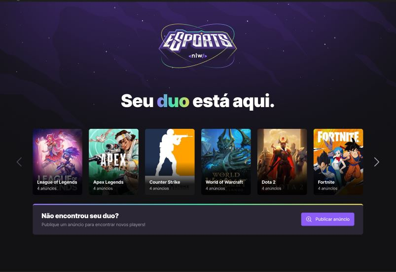
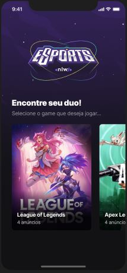

<h1 align="center">
	
</h1>

<h3 align="center">
  Project developed during the 9th Edition of Next Level Week held by <a href="https://www.rocketseat.com.br/">Rocketseat</a>.
</h3>

<p align="center">
  

  <a href="https://www.linkedin.com/in/igor-gomes-da-silva/">
    
  </a>
  
  
</p>

<p align="center">
  <a href="#-about-the-project">About the project</a>&nbsp;&nbsp;&nbsp;|&nbsp;&nbsp;&nbsp;
  <a href="#-technologies">Technologies</a>&nbsp;&nbsp;&nbsp;|&nbsp;&nbsp;&nbsp;
  <a href="#-getting-started">Getting started</a>&nbsp;&nbsp;&nbsp;|&nbsp;&nbsp;&nbsp;
  <a href="#-lyout">Layout</a>&nbsp;&nbsp;&nbsp;|&nbsp;&nbsp;&nbsp;
  <a href="#-license">License</a>
</p>

  
  

## 👨🏻‍💻 About the project

- <p>This project aims to help gamers to find other people more easily so that they can be playing together.</p>

## 🚀 Technologies

Technologies that I used to develop this api

### 🌐 Back-end

- [Node.js](https://nodejs.org/en/)
- [TypeScript](https://www.typescriptlang.org/)
- [Express](https://expressjs.com/pt-br/)
- [Prisma](https://www.prisma.io/)
- [SQLite](https://www.sqlite.org/)

### 💻 Front-End web

- [ReactJS](https://reactjs.org/)
- [TypeScript](https://www.typescriptlang.org/)
- [Vite](https://vitejs.dev/)
- [Tailwind CSS](https://tailwindcss.com/)
- [Axios](https://github.com/axios/axios)
- [Phosphor Icons](https://phosphoricons.com/)
- [Radix](https://www.radix-ui.com/)

### 📱 Front-End mobile

- [React Native](https://reactnative.dev/)
- [TypeScript](https://www.typescriptlang.org/)
- [Expo](https://expo.io/)
- [Phosphor Icons](https://phosphoricons.com/)

## 💻 Getting started

### Requirements

- [Node.js](https://nodejs.org/en/)
- [Yarn](https://classic.yarnpkg.com/) or [npm](https://www.npmjs.com/)
- [Expo-cli](https://docs.expo.dev/workflow/expo-cli/)

**Clone the project and access the folder**

```bash
$ git clone https://github.com/Igor2502/NLW-9-eSports.git && cd NLW-9-eSports
```

**Follow the steps below**

### Backend

```bash
# Starting from the project root folder, go to backend folder
$ cd server

# Install the dependencies
$ npm install

# make sure the environment variables are set correctly in the '.env' file

# Once the services are running, run the migrations
$ npx prisma migrate dev

# To finish, run the api service
$ npm run dev

# Well done, project is started!
```

### Web

_Obs.: Before to continue, be sure to have the API running_

```bash
# Starting from the project root folder, go to frontend folder
$ cd web

# Install the dependencies
$ npm install

# Start the client
$ npm run dev
```

### Mobile

_Obs.: Before to continue, be sure to have the API running_

```bash
# Starting from the project root folder, go to mobile folder
$ cd mobile

# Install the dependencies
$ npm install

# Start the app
$ expo start
```

## 🔖 Layout

You can view the layout of the project through [this link](https://www.figma.com/file/4m5VumfDGLIrmytgBKbYCn/NLW-eSports-(Community)?node-id=6%3A23). A [Figma](https://figma.com) account is required to access it.

## 📝 License

This project is licensed under the MIT License - see the [LICENSE](LICENSE) file for details.

---

Made with 💜 &nbsp;by Igor Gomes 👋 &nbsp;[See my linkedin](https://www.linkedin.com/in/igor-gomes-da-silva/)